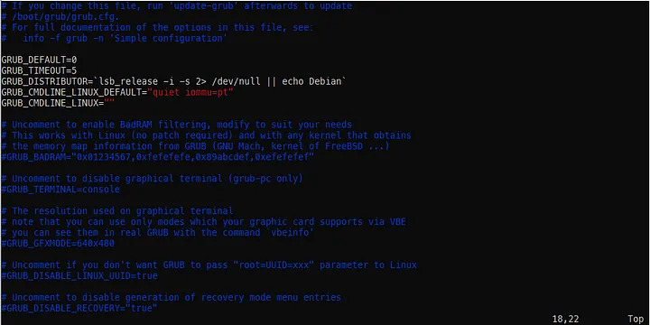

**TL;DR** update `/etc/default/grub` and add `iommu=pt` to `GRUB_CMDLINE_LINUX_DEFAULT`. ie `GRUB_CMDLINE_LINUX_DEFAULT="quiet iommu=pt"`

## Intro

I bought a used piece of hardware from Ebay as an upgrade to my RPI3B+ to build network-attached storage (NAS) for my home network. When I tried installing Debian 10 "buster", I noticed that my device kept randomly failing during the installation. Giving it a chance, I just kept trying to install the OS until it worked. As I was installing packages on the system, I noticed that it would crash during large downloads. This is when I started to investigate why my HP EliteDesk 705 G1 Mini was crashing.

## Findings

I did some digging and found the ethernet adapter being used was a Broadcom 5762, which seemed to have some driver issues in Linux from `tg3`. I looked at this thread here which discussed the issue in detail since 2015. https://bugs.launchpad.net/ubuntu/+source/linux/+bug/1447664

Interestingly, there doesn't seem to be a fix despite a large back-and-forth between the community. I found a recent comment that changed the GRUB configuration of the system. The root of the issue seems to be due to a bug in the direct memory access (DMA) address translation. By configuring the ethernet adapter to use the pass-through setting, the adapter does not utilize DMA translation to memory and actually improves the network performance.

## The Fix

We can take a look at our grub configuration which is located here:

```
/etc/default/grub
```

This file will look similar to this:



The important change you will need to make is at `GRUB_CMDLINE_LINUX_DEFAULT`. We want to allow the network passthrough to disable the DMA address translation.

You'll need to make the following change:

```bash
GRUB_CMDLINE_LINUX_DEFAULT="iommu=pt"
```

If you have other configurations (like I do with `quiet`) you can simply add a space between each item. Make sure there are no spaces between the equal sign (=).

Now make sure to update your changes on the command line:

```bash
sudo update-grub
```

## Conclusion

I hope you found this helpful and I hope you will enjoy your Linux system!
