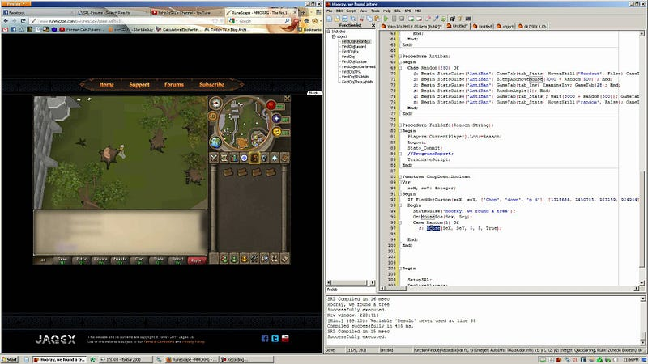

Why did you choose software development?

Software development is a vast field filled with endless opportunities. You like dogs? Make a Tinder for dogs. Hate cabs? Make Uber. Want to make friends? Make Meetup.

The point is, software development is all about taking an idea and building it.

At a young age, I knew that I loved building things; whether it was snow forts, my Runescape character or my lego empire. I didn't socialize too much growing up but I was exposed to my parents which had careers in construction and social work. My love for building is from my father and my interest in understanding human behavior is from my mother.

From what I've been told, growing up I had an affinity for math and computers. I remember staring at this wall of beads that had different quantities of beads in different shapes representing numbers in day care.

There was some exercise you had to do 3 times in order to use the computer - which I did every time because there was a Disney game I needed to play. This naturally got me thinking about numbers, how to add, subtract, multiply and divide.

So growing up, as my parents saw I had a "natural" understanding of mathematics, I was encouraged to pursue engineering. Little did I know at the time, engineering is broad. This lead me to think about what exactly I loved doing; however, at the time I was more focused on playing Minecraft and League of Legends so it really didn't concern me to give it real thought.

After playing Minecraft enough to get sick of the main game, I looked into ways people modified the game. I looked up how I could build my own mods as it peaked my building interest. This got the snowball rolling and I watched YouTube tutorials on how to program in Java by Bucky Roberts https://www.youtube.com/user/thenewboston.

I'm probably one of the worst stories for trying to learn how to do software development. I think I did 5 different Java tutorials until I understood what all the keywords meant - even to the main function left me clueless. Eventually, the information stuck and at that point, I kept snowballing information.

As a kid I built a few things, an RPG in C# with the Unity engine, a simple Minecraft mod that colored tiles and I built bots for Runescape Private Servers. It's pretty clear what my interests where at the time, and I'm honestly not ashamed to say that video games were my biggest motivation to pursue software development. I could see how this seemingly magical, easily scalable tool with no upfront costs generated so much happiness in not only my life but others around me.

And now here I am today, with my ancient Github account created June 9th, 2012 pursuing a Computer Science degree at University of Waterloo.

Now I can answer, "Why did you choose software development?"

Would you believe me if I told you it was because of video games?
